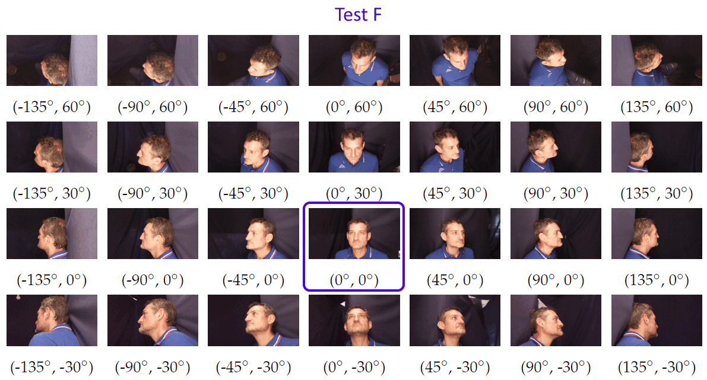
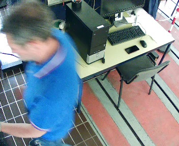
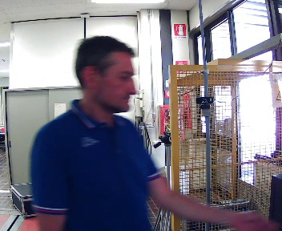
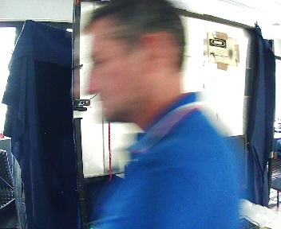
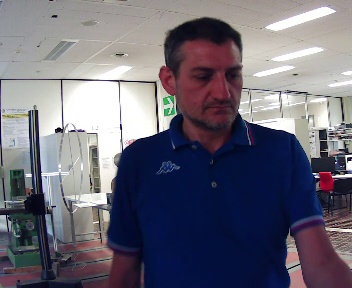
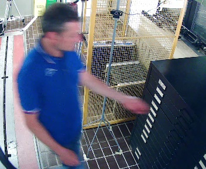

# Face Recognition Experiments on the Face Recognition from Mugshots Database (FRMDB)

This repository contains the source code of the experiments presented in
> Contardo, P.; Sernani, P.; Tomassini, S.; Falcionelli, N.; Martarelli, M.; Castellini, P.; Dragoni, A.F. FRMDB: Face Recognition Using Multiple Points of View. Sensors 2023, 23, 1939. <https://doi.org/10.3390/s23041939>

The paper is published in the special issue [Biometric Recognition System Based on Iris, Fingerprint and Face](https://www.mdpi.com/journal/sensors/special_issues/5ZH0DZ8318) of  the [Sensors](https://www.mdpi.com/journal/sensors) journal. The paper is open access and available here: <https://www.mdpi.com/1424-8220/23/4/1939>

The source code of the experiments on the datasets is contained in a Jupyter notebook, available in the “notebooks” directory of this repository. The notebook is "[Face_Recognition_with_the_Face_Recognition_from_Mugshots_Database_(FRMDB).ipynb](notebooks/Face_Recognition_with_the_Face_Recognition_from_Mugshots_Database_(FRMDB).ipynb)"

Specifically, the experiments are **accuracy tests of two different Convolutional Neural Networks (CNNs)**, pre-trained on the [VGGFace](https://www.robots.ox.ac.uk/~vgg/data/vgg_face/) and [VGGFace2](https://github.com/ox-vgg/vgg_face2) databases, on the **Face Recognition from Mugshots Database (FRMDB)**.

The FRMDB is publicly available in a dedicated GitHub repository:

>[https://github.com/airtlab/face-recognition-from-mugshots-database](https://github.com/airtlab/face-recognition-from-mugshots-database)

Specifically, we tested VGG16 and ResNet50, using the configurations presented in

>Parkhi, O.M.; Vedaldi, A.; Zisserman, A. Deep face recognition. British Machine Vision Association 2015. [PDF](https://www.robots.ox.ac.uk/~vgg/publications/2015/Parkhi15/parkhi15.pdf)

for **VGG16**, and in 

>Cao, Q.; Shen, L.; Xie, W.; Parkhi, O.M.; Zisserman, A. VGGFace2: A Dataset for Recognising Faces across Pose and Age. In Proceedings of the 2018 13th IEEE International Conference on Automatic Face & Gesture Recognition (FG 2018), 2018, pp. 67–74. [PDF](https://www.robots.ox.ac.uk/~vgg/publications/2018/Cao18/cao18.pdf)

for **ResNet50**. Instead of running again the training on VGG16 and ResNet50, we used the weights and the models available in

><https://github.com/rcmalli/keras-vggface>

Such repository includes the Keras conversion of the original CAFFE networks and weights.

## Data Description

The experiments are based on the FRMDB images and videos. The FRMDB is available in the following public repository: 
>[https://github.com/airtlab/face-recognition-from-mugshots-database](https://github.com/airtlab/face-recognition-from-mugshots-database)

The database includes images and videos of 39 subjects. Specifically, for each subject there are:

- 28 mugshots, i.e., 28 972x544 JPEG image takens from different points of views with the subject posing during the acquisition.

- 5 security cameras videos, taken from 5 points of views. In addition, a mosaic video including all the 5 clips at the same time is available. The 5 videos are 60 fps 352x288 H.264 encoded clips (the container format is matroska - mkv). The frame size of the mosaic is 1280x720.

In the experiments we used the face manually cropped from the mugshots and from 1 frame of each security video. The cropped faces are available in the FRMDB repository.

## Experiments

The experiments perform the **comparison** the embedding of the faces of each subject in the **security cameras** with different **set of mugshots** available in the FRMDB. The embeddings are computed using **VGG16** and **ResNet50**.

The experiments consists of **8 different tests** to identify the subjects in the security camera images:
- *Test F*, using the **frontal mugshot** (33, according to the code used in the FRMDB) of each subject for the comparison.
- *Test F-L1-R1*, using the **frontal** mugshot (33) and the mugshots **to the left and to the right of the frontal** (i.e., 23 and 43).
- *Test 1*, using the **frontal** mugshot (33) and **the right profile** (53) of each subject.
- *Test 2*, using the **frontal** mugshot (33), the **right** profile (53), and the **left** profle (13) of each subject.
- *Test 3*, using the mugshots of the ***Test F-L1-R1*** and ***Test 2*** (i.e., 13, 23, 33, 43, 53)
- *Test 4*, adding the images with **highest left** (03) and **right** (63) angles to ***Test 3***.
- *Test 5*, which adds **all the images 30° above the subject** (i.e., 02, 12, 22, 32, 42, 52, 62) to the mugshots of ***Test 4***.
- *Test 6*, which uses **all the 28 mugshots** available for each subject in the FRMDB.

The following images visualize the subset of mugshots available in each test (the image is related to the subject 031 of the FRMDB).

The following table lists all the mugshots available in each test for each subject as a couple (*h*, *v*) where *h* is the angle from which the mugshot was taken on the horizontal plane, and *v* is the angle on the vertical plane.

| **Test**     | **Mugshots**                                                                                                                                                                                                                                                                                                                                                        |
|:-------------|:--------------------------------------------------------------------------------------------------------------------------------------------------------------------------------------------------------------------------------------------------------------------------------------------------------------------------------------------------------------------|
| Test F       | (0°, 0°)                                                                                                                                                                                                                                                                                                                                                            |
| Test F-L1-R1 | (0°, 0°), (-45°, 0°), (45°, 0°)                                                                                                                                                                                                                                                                                                                                     |
| Test 1       | (0°, 0°), (90°, 0°)                                                                                                                                                                                                                                                                                                                                                 |
| Test 2       | (0°, 0°), (90°, 0°), (-90°, 0°)                                                                                                                                                                                                                                                                                                                                     |
| Test 3       | (0°, 0°), (90°, 0°), (-90°, 0°), (45°, 0°), (45°, 0°)                                                                                                                                                                                                                                                                                                               |
| Test 4       | (0°, 0°), (135°, 0°), (-135°, 0°), (90°, 0°), (-90°, 0°), (45°, 0°), (45°, 0°)                                                                                                                                                                                                                                                                                      |
| Test 5       | (0°, 0°), (135°, 0°), (-135°, 0°), (90°, 0°), (-90°, 0°), (45°, 0°), (45°, 0°), (0°, 30°), (135°, 30°), (-135°, 30°), (90°, 30°), (-90°, 30°), (45°, 30°), (45°, 30°)                                                                                                                                                                                               |
| Test 6       | (0°, 0°), (135°, 0°), (-135°, 0°), (90°, 0°), (-90°, 0°), (45°, 0°), (45°, 0°), (0°, 30°), (135°, 30°), (-135°, 30°), (90°, 30°), (-90°, 30°), (45°, 30°), (45°, 30°), (0°, 60°), (135°, 60°), (-135°, 60°), (90°, 60°), (-90°, 60°), (45°, 60°), (45°, 60°), (0°, -30°), (135°, -30°), (-135°, -30°), (90°, -30°), (-90°, -30°), (45°, -30°), (45°, -30°)          |

For each test, we measured the capability of VGG16 and ResNet50 to identify the subject in each image from the security cameras, by registering if **the subject** was **included** in the **top-1**, **top-3**, **top-5**, and **top-10 most similar mugshots**, and in the **top-1**, **top-3**, **top-5**, and **top-10 nearest identities**. To evaluate the similarity between a face in a mugshot and a face in the image from a security camera, we use the **Euclidean distance** as the similarity measure between the **two face embeddings**. Given such similarity criterion, we measure the accuracy as follows:
- For the **most similar identities**, we compute the accuracy as the **number of security camera images** for which the **correct subject** was in the **top-1**, **top-3**, **top-5**, and **top-10** nearest identities **over the total** number of security camera images.
- For the **most similar mugshots**, we compute the accuracy as the **number of security camera images** for which the **correct subject** was in the **top-1**, **top-3**, **top-5**, and **top-10** most similar mugshots **over the total** number of security camera images.
Obviously, the top-1 identity and the top-1 mugshot overlap.

The following images shows a frame for each of the security camera videos related to the subject 031 of the FRMDB

	
	
	

	
	

## Data and Source Code Release Agreement

The source code of the experiments is freely released for research and educational purposes. Please cite as
- Contardo, P.; Sernani, P.; Tomassini, S.; Falcionelli, N.; Martarelli, M.; Castellini, P.; Dragoni, A.F. FRMDB: Face Recognition Using Multiple Points of View. Sensors 2023, 23, 1939. <https://doi.org/10.3390/s23041939>
 
Bibtex entry:

	 @article{Contardo2023,
	   author = {Contardo, Paolo and Sernani, Paolo and Tomassini, Selene and Falcionelli, Nicola and Martarelli, Milena and Castellini, Paolo and Dragoni, Aldo Franco},
	   title = {{FRMDB}: Face Recognition Using Multiple Points of View},
	   journal = {Sensors},
	   volume = {23},
	   year = {2023},
	   number = {4},
	   article-number = {1939},
	   doi = {10.3390/s23041939}
	 }

The paper is open access and available here: <https://www.mdpi.com/1424-8220/23/4/1939>